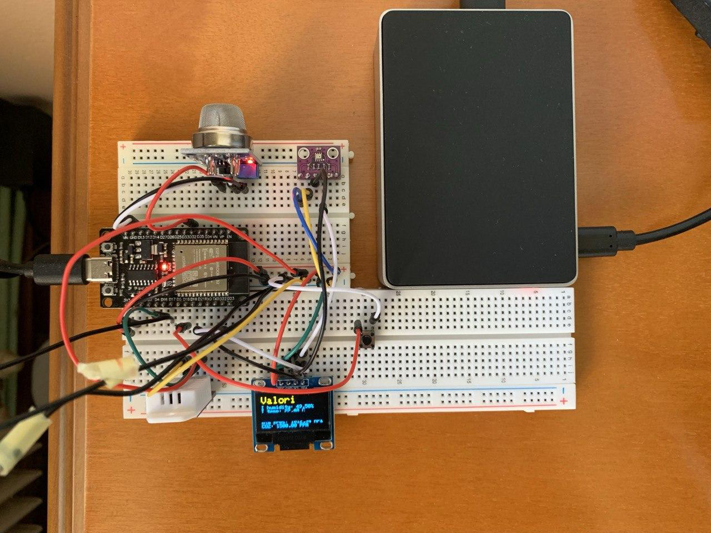
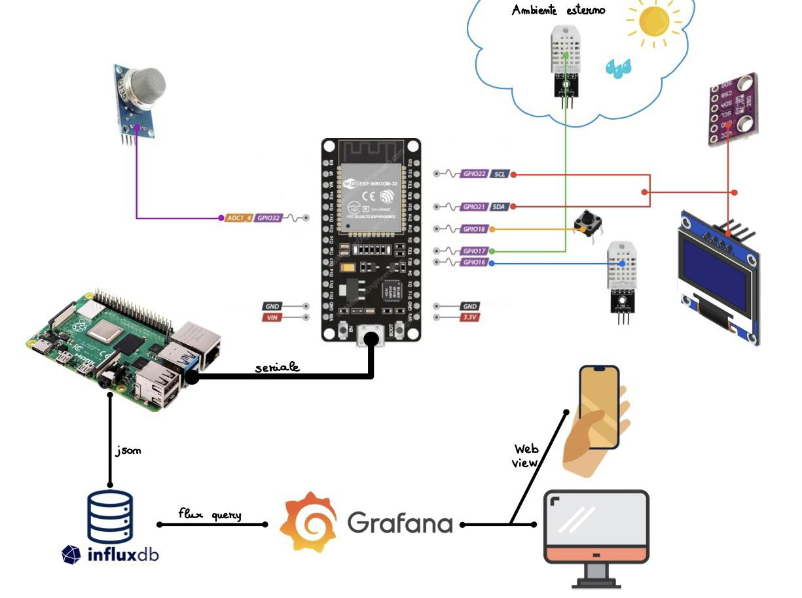
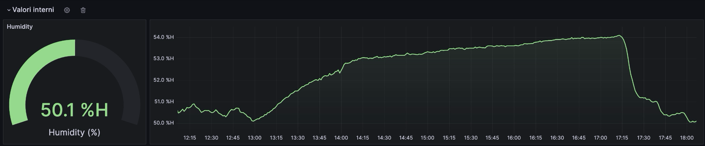
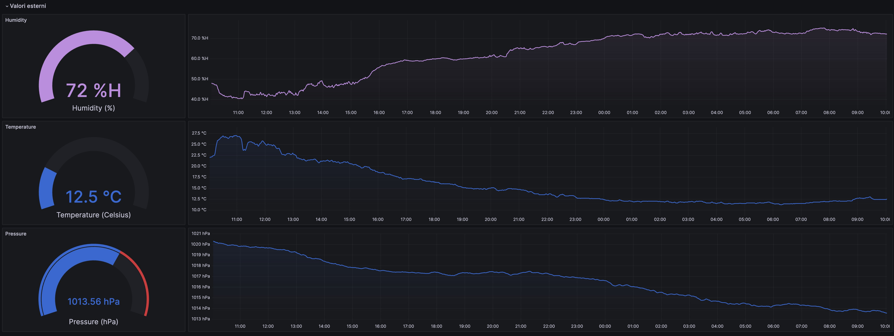
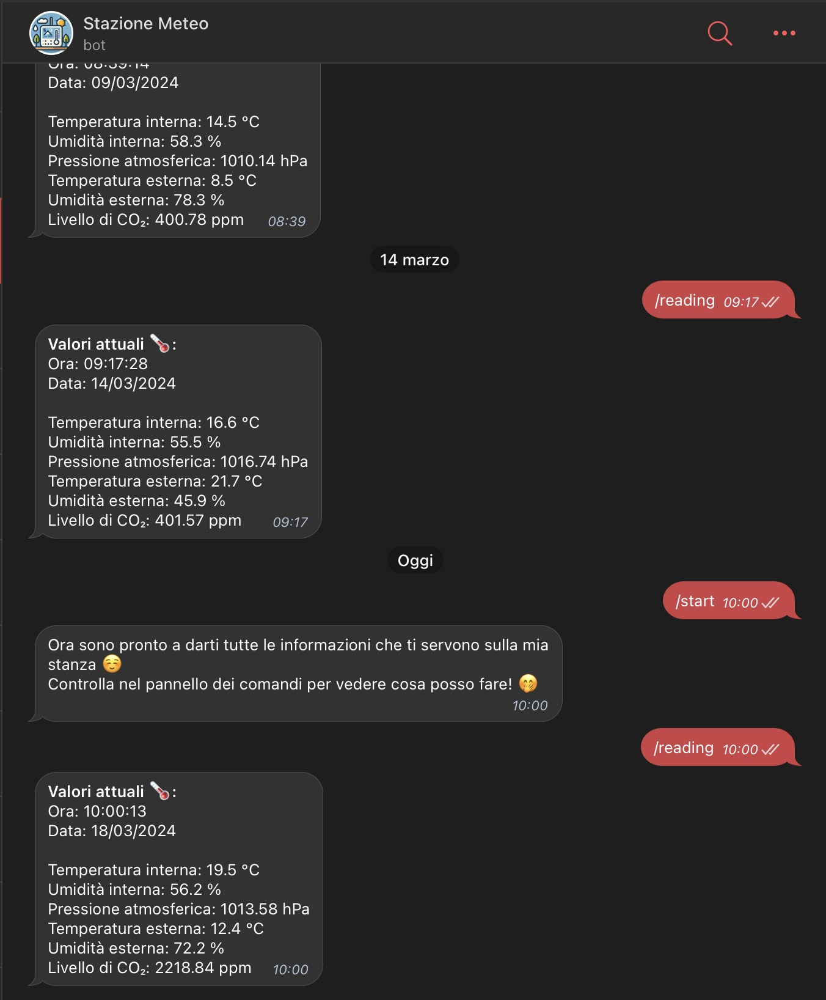
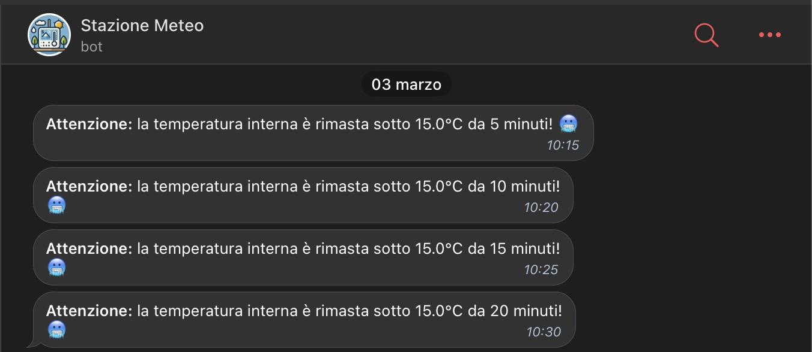

# IoT Weather Station 🌦️
Combining ESP32 and Raspberry Pi 4B capabilities to create a fully autonomous weather station that reads data from sensors, stores the data in a database, presents the data with explanatory graphs and can communicate with telegram.

This was a project for IoT exham at the University of Udine made with another student.

It's initial capabilities did not include telegram integration and was added by me only after the project was delivered.

## How does it work? 🤔
ESP32 reads the data from a few sensors:
- DHT22, for temperature and humidity (there is one placed inside the room and one outside the window)
- BMP280, for atmospheric pressure
- MQ135, for air quality

These sensors are placed on a breadboard together with some other components, such as:
- OLED Display, to read real time data from the sensors directly from the weather station
- Button, this button allows you to turn the display on and off

The ESP32 is connected to the Raspberry and, with a python script, the data from the sensors is read through serial communication using PyFirmata. The data read then goes into an InfluxDB database that is used to populate the graphs shown in Grafana to show internal temperature and humidity, external temperature and humidity, atmospheric pressure and the level of CO2 present in the room.

All of this can be accessed through the local network using the raspberry Pi's IP, followed by Grafana port (3000).

Another way to check the data read from the sensors is using the telegram bot that can also notify the user if the room temperature is below 15.0 °C for more than 5 minutes. 

/reading command      | Temperature notifications
:-------------------------:|:-------------------------:
 |  

This feature has been implemented to accommodate the need to know if the window of the room where the sensors are located has been left open for a long period of time, which is especially useful in winter.
